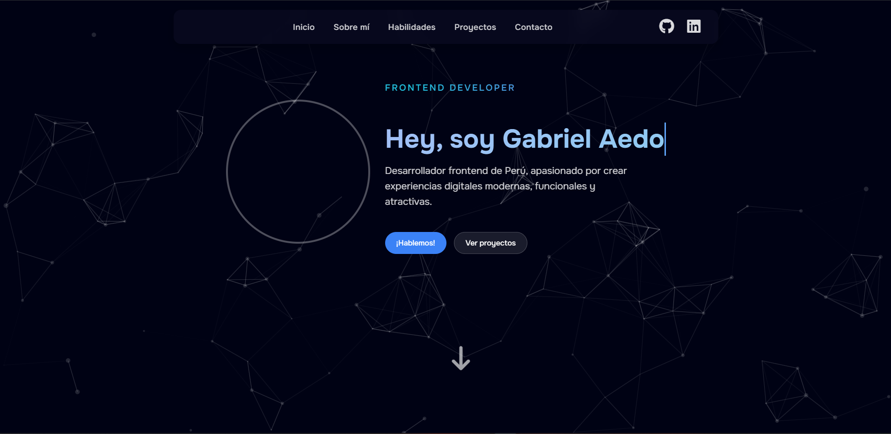

# 🌐 Portafolio Personal



> Mi portafolio web personal, desarrollado con **Astro** y gestionado con **pnpm**.  
> Aquí muestro mis habilidades, proyectos y un poco sobre quién soy.

---

## 🚀 Tecnologías

- ⚡ [Astro](https://astro.build/)  
- 📦 [pnpm](https://pnpm.io/)  

---

## 📥 Instalación y uso

Clona este repositorio e instala las dependencias con **pnpm**:

```bash
git clone https://github.com/tu-usuario/tu-portafolio.git
cd tu-portafolio
pnpm install
